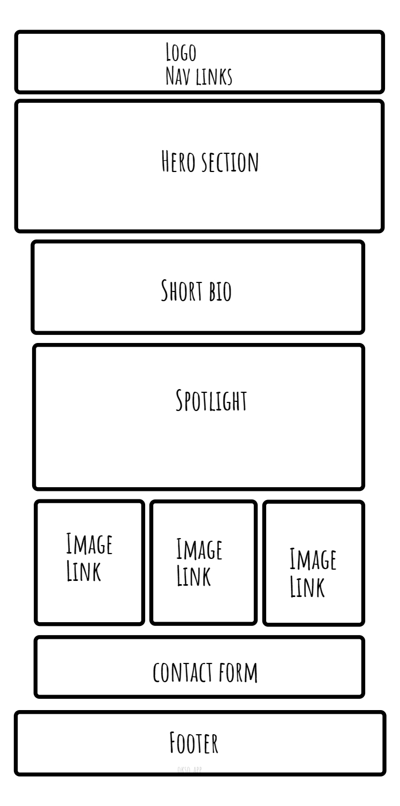

# Project-201

## The Wedding Guidebook

This project is a website that contains content for people who are planning their wedding. It has an index page which introduces the site, has some wedding inspired content and a contact form. This site is also designed to add some lighthearted fun, so it has some random generators that will suggest first dance songs and wedding themes. Both generators will have a form so that users can submit their own ideas for the generators, which are then added to their Local Storage. Users will also be able to change the colour scheme from a selection of options, which is also stored to Local Storage.

### Team Members

Individual Project.

### Problem Domain

The Wedding Guidebook Company has come up with an idea to build a website that serves as inspiration for people who are planning their wedding. Initially, they would like an index page, an about us page and a third page for interactivity.

For the index page, they would like a brief introduction to the site. They would like a spotlight section which features their chosen spotlight of the week and some smaller sections with images which work as links to other pages, such as a dresses page, a venues page and a themes page (they does not need these pages made at this time; just a space on the index to link to them). They would also like a contact us form somewhere on the page.

For the About Us page, they would like information on what the website is used for.

They also want a page that will add a little fun to the site, which includes a random generator and a space for users to upload their ideas to be included in the generator. When using the generator, they do not want the same result to be given immediately after.

Finally, they would like the user to have a selection of three colour schemes to choose from for the website which will change the colour theme of the website. They want this to work across the pages and to remain the next time they return to the site.

### Wireframe

### User Stories (and how to achieve them.)

**As a user, I would like a header and footer that can be used across pages.**

Header section:

1. Choose a google font for the h1/logo.
2. Add a nav bar of 3 links: Home, About, Random Generators.
3. Add link to logo/title that takes you to the homepage.

Footer section:

1. Add copyright text/date.
   Stretch goal: add further links/details.

Add header and footer to other pages.

**As a user, I would like a hero section with a wedding themed image and brief text to encapsulate the site.**

1. Create a hero section with an image with text that sits below it.
2. Using a media query, change the image and text to stretch across width the page for a bigger screen.

**As a user, I would like a brief introduction to the page that stands out.**

1. Add a section for a brief introduction to the page.
2. Give this a background colour.

**As a user, I would like a spotlight section for the week's chosen 'spotlight' item.**

1. Add a section which involves an image, a header and info about the spotlight item.

**As a user, I would like some smaller sections which contain an image and link to category pages.**

1. Create small sections/cards which consist of a relevant image and link.

**As a user, I would like an about us page which explains what the website is for.**

1. Add a section with a header, and image and information about the website and it's aim.

**As a user, I would like a random generator page where I can get wedding song ideas. I would like to know the name of the song, the artist and have an image for the genre/style of music.**

1. In HTML:
   - Create a container and give it an id.
   - Add a header.
   - Add a h3 – but leave it empty.
   - Add an image.
   - add a p element but leave it empty.
2. In JS, get the container element by id in global scope.
3. Create a constructor function for wedding songs; using the key:value pairs for a name, the artist, a genre and an image linked to the genre.
4. Create an array that holds all the songs.
5. Create a random function that will loop through the length of all the songs in the array.
6. Create a render function to display the song details and image.
   - Select the image, header and paragraph elements.
   - Set Atributes and change text content using values from the constructor functions.
   - Append the elements to the container.
7. Hard code objects (new songs) for the Constructor function.
8. Create function to handle randomiser button click:
   - Add an event listener to the button to listen for clicks and to then randomise and display the song.
   - Declare a variable that uses the random number function.
   - Declare a variable for a song which uses the random number to select that index from the all songs array.
   - Use the render function to display the results of the random song.

**As a user, I do not want the same song to repeat immediately after.**

1. Create an array that holds the used songs.
2. Use an if statement that empties the array when all the songs have been displayed.
3. Create a while loop that uses includes to check if a song/index number is already in the used songs array – if it is, generate a new random number.

**As a user, I would like to be able to add my own ideas to the generator.**

1. Create a form in HTML so the user can submit song suggestions with a name text input, an artist text input and a genre text input.
2. Create a submit button.
3. Add an Event Listener which adds the form content as a new object.
   - Prevent default so page does not refresh on submit.
   - Declare variables to get form values.
   - Use form values to create new Song object.
   - Reset the form.

**As a user, I would like a selection of three themes to choose between for the website.**

1. Add radio buttons for the choice of themes.
2. Create class CSS for each theme/mode (normal, colour 1, colour 2).  
   _Target:_
   - Header/footer background colour.
   - Bio background colour.
   - Button colours.
3. On radio buttons: Get Element by Id and put Event Listeners on for when clicked.
4. Create a function for/to enter each theme/mode:
   - Get elements you want to target.
   - Use if statement to remove other classes.
   - Add new class/theme.
   - Set button attribute to clicked.

**As a user, I want my theme to work across pages and remember my choice the next time I visit the page.**

1. Add a function to save the themes.
   - Declare variable and use JSON.stringify on the theme/mode.
   - Use set item to store to local storage.
2. Add function for when the page loads.
   - Declare variable and use JSON parse to get theme from local storage.
   - Use if statement to choose the right theme function.
3. invoke save functions in earlier ‘enter theme’ functions.
4. invoke the function for when the page loads.

**As a user, I want an animation somewhere on my page.**

1. Add an animation to buttons in CSS to make it look like the button has been pressed down.

_Stretch goals:_

- Create a heart with CSS and make it pulse on hover.
- Store Form Data to Local Storage.
- Create a quiz.
- Nav Drop-down links.

---

#### Image credit:

- [Photo by Edward Eyer](https://www.pexels.com/photo/man-playing-guitar-811838/)
- [Photo by Nothing Ahead](https://www.pexels.com/photo/acoustic-musical-instrument-placed-on-green-grass-6863798/)
- [Photo by Pixabay](https://www.pexels.com/photo/chords-sheet-on-piano-tiles-210764/)
- [Photo by Donald Tong](https://www.pexels.com/photo/theater-interior-109669/)
- [Photo by Mark Angelo Sampan](https://www.pexels.com/photo/group-of-people-in-a-concert-1587927/)
- [Photo by Boris Hamer](https://www.pexels.com/photo/pioneer-dj-sound-mixer-16645407/)
- [Photo by Matheus Bertelli](https://www.pexels.com/photo/person-sitting-and-playing-keyboard-16674137/)
- [Photo by Pixabay](https://www.pexels.com/photo/low-angle-view-of-lighting-equipment-on-shelf-257904/)
- [Photo by Kyle Roxas](https://www.pexels.com/photo/woman-wearing-white-floral-wedding-dress-standing-on-rocks-near-body-of-water-2122363/)
- [Photo by Amar Preciado](https://www.pexels.com/photo/a-wedding-venue-12954021/)
- [Photo by Jeremy Wong](https://www.pexels.com/photo/4-tier-cake-on-cake-stand-1038711/)
- [Photo by Trung Nguyen](https://www.pexels.com/photo/bridge-and-groom-standing-while-holding-flower-bouquet-2959192/)
- [Photo by Joel Paim](https://www.pexels.com/photo/photo-of-wedding-setup-2291462/)
- [Photo by Amar Preciado](https://www.pexels.com/photo/a-newlywed-couple-dancing-10360896/)
- [Photo by Photography Maghradze PH](https://www.pexels.com/photo/newlyweds-posing-in-snow-10924994/)
- [Photo by RDNE Stock project](https://www.pexels.com/photo/an-old-book-and-candles-on-wooden-table-with-glass-bottles-7978061/)
- [Photo by Key Notez](https://www.pexels.com/photo/man-and-woman-getting-married-on-the-beach-12178593/)
- [Photo by Erik Mclean](https://www.pexels.com/photo/close-up-of-a-wedding-decoration-9738252/)
- Photo by <a href="https://unsplash.com/@gayanianu?utm_source=unsplash&utm_medium=referral&utm_content=creditCopyText">Gayani Anuththara</a> on <a href="https://unsplash.com/photos/Qkz0IFYmg7g?utm_source=unsplash&utm_medium=referral&utm_content=creditCopyText">Unsplash</a>
- Photo by <a href="https://unsplash.com/@ergo_zakki?utm_source=unsplash&utm_medium=referral&utm_content=creditCopyText">Ergo Zakki</a> on <a href="https://unsplash.com/photos/QjLE11j5FT8?utm_source=unsplash&utm_medium=referral&utm_content=creditCopyText">Unsplash</a>
